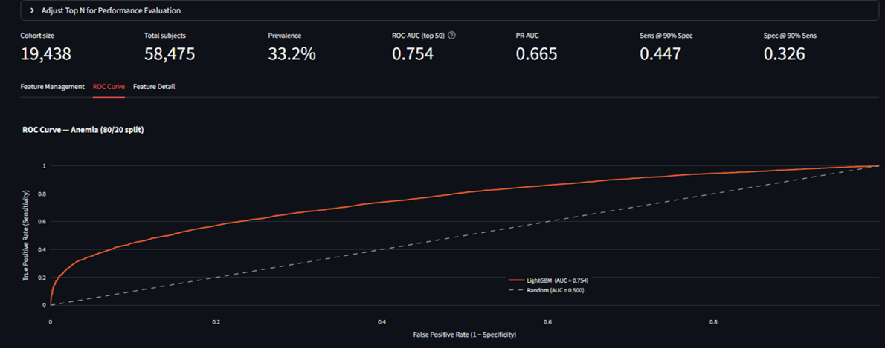
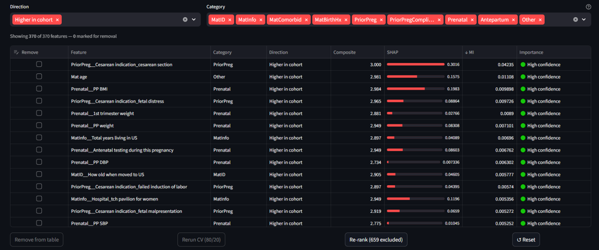
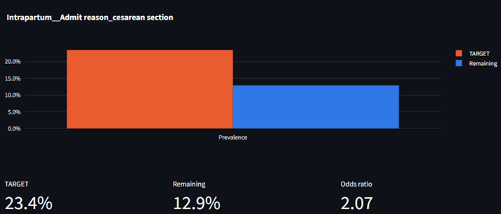
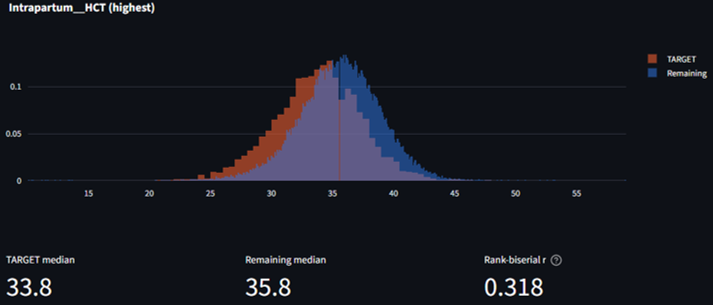

# PeriMiner

PeriMiner is an end-to-end research informatics platform for the PeriBank perinatal cohort at Baylor College of Medicine and Texas Children's Hospital. It ingests raw clinical exports, extracts and normalizes medical concepts from free-text fields, and produces an ML-ready feature matrix used to rank patient features most strongly associated with any user-defined cohort.

The pipeline has been applied to more than 57,000 perinatal research records integrating structured clinical data, medications, free-text encounter notes, and a custom survey instrument (~30% of fields) covering medical and family history, demographics, socioeconomic status, and environmental exposures including hurricane impact. An interactive Streamlit dashboard supports two analysis modes (single cohort vs. rest, or two-cohort head-to-head) with LightGBM + SHAP feature ranking, mutual information and importance scores, interactive filtering, and per-feature distribution views with effect-size estimates.

PeriMiner is a research tool, not a production clinical system. The underlying database is partially abstracted from the medical record and intended for retrospective hypothesis generation. This repository contains code only; PeriBank data is restricted and not distributed here.

## Screenshots

Cohort summary with model performance and ROC curve. Example shown: an anemia cohort (n=19,438) against the rest of PeriBank (n=58,475), 80/20 train-test split, ROC-AUC 0.754.



Feature ranking table. Each row is a database feature scored by SHAP, mutual information, and LightGBM importance; categories are filterable from the bar above; features can be removed and the model re-ranked in place.



Per-feature detail for a binary feature, showing prevalence in cohort vs. comparator with odds ratio.



Per-feature detail for a continuous feature, showing overlaid distributions with rank-biserial correlation as effect size.



## Dashboard

```bash
streamlit run dashboard.py
```

The dashboard supports two analysis modes:

- **Single cohort vs. rest**: define one cohort by search terms; ML compares it against all other subjects in PeriBank.
- **Compare two cohorts**: define Cohort A and Cohort B separately; ML compares them directly against each other.

Features include boolean cohort filtering, interactive feature ranking with LightGBM + SHAP, category-based feature management, and per-feature distribution plots.

See `PeriMiner Quickstart.txt` for a plain-language walkthrough of the dashboard workflow.

## Pipeline

```
DB_1  Assemble raw exports → PBDBfinal.txt
  ↓
DB_2  Clean, curate, split → PBDBfinal_cleaned.csv, _meds.csv, _details.csv
  ↓
DB_3  Claude concept extraction (Batch API, one-time) → claude_extraction_cache.json
  ↓
DB_4  Build UMLS concept map (scispaCy) → token_to_concept.json
  ↓
DB_5a  Meds fuzzy-match + boolean ─┐
DB_5b  NLP free-text → boolean     ├─ (run in parallel)
  ↓                                │
DB_6  Reassemble → PBDBfinal_ready_forML.pkl
```

| Script | Description |
|---|---|
| `DB_0_build_pipeline.py` | Orchestrator: runs the full pipeline in dependency order |
| `DB_1_recreate.py` | Consolidates PeribankDB export files, applies PREFIX__column naming |
| `DB_2_clean.py` | Data curation, reduction, feature selection; splits into cleaned/meds/details CSVs |
| `DB_3_claude_extract.py` | Extracts medical concepts from free-text via Claude Batch API (resumable, cached) |
| `DB_4_build_umls_map.py` | Builds `token_to_concept.json` via scispaCy UMLS entity linking |
| `DB_5a_meds.py` | Medication fuzzy-matching (rapidfuzz) + booleanization |
| `DB_5b_NLP.py` | NLP processing of free-text detail columns + booleanization |
| `DB_6_reassemble_forML.py` | Joins cleaned + meds + details into final ML-ready pickle |

## ML modules

| Script | Description |
|---|---|
| `ML_1_Subject_search.py` | Cohort search with morphological expansion and fuzzy matching |
| `ML_2_most_unique.py` | Univariate + discriminative feature ranking (LightGBM, SHAP, MI) |
| `dashboard.py` | Streamlit dashboard for single-cohort or dual-cohort comparison analysis |

## Claude concept extraction (DB_3)

DB_3 submits free-text cells to the Anthropic Batch API for medical concept extraction. It is fully resumable, re-running costs nothing for already-cached cells. Requires `ANTHROPIC_API_KEY` in `.env`.

```bash
python DB_3_claude_extract.py                # full run
python DB_3_claude_extract.py --poll-only    # resume after interruption
python DB_3_claude_extract.py --dry-run      # estimate cost without submitting
```

## UMLS concept normalization (DB_4)

DB_4 uses scispaCy's EntityLinker to map Claude-extracted concepts to canonical UMLS names. This collapses synonyms/abbreviations (e.g. "htn", "hypertensive", "hypertension" all become `hypertension`) and strengthens ML signal.

- `umls_overrides.json`: Manual token-to-concept mappings that override UMLS. Human-editable, no PHI.
- `token_to_concept.json`: Generated mapping (gitignored, contains tokens from patient records).

To rebuild the concept map:
```bash
python DB_4_build_umls_map.py
```

## Installation

**Prerequisites:** Python 3.8–3.10 recommended (`pandas` is pinned to 1.5.3 for pickle compatibility).

```bash
# Clone the repository
git clone https://github.com/mdsefero/PeriMiner.git
cd PeriMiner

# Create and activate a virtual environment
python -m venv .venv
source .venv/bin/activate        # Linux / WSL
# .venv\Scripts\activate         # Windows PowerShell

# Install dependencies
pip install -r requirements.txt

# Install the scispaCy biomedical model (required for DB_4 UMLS linking)
pip install https://s3-us-west-2.amazonaws.com/ai2-s2-scispacy/releases/v0.5.4/en_core_sci_lg-0.5.4.tar.gz

# Create a .env file with your Anthropic API key (required for DB_3)
echo "ANTHROPIC_API_KEY=your_key_here" > .env
```

## Quick start

```bash
# Full pipeline
python DB_0_build_pipeline.py

# Resume from a specific step
python DB_0_build_pipeline.py --from DB_3

# Skip to reassembly (DB_5a+DB_5b already done)
python DB_0_build_pipeline.py --from DB_6

# Dry run (print steps without executing)
python DB_0_build_pipeline.py --dry-run
```

## License

BSD 3-Clause. See [LICENSE](LICENSE) for details.

## Author

Maxim D. Seferovic, PhD, seferovi@bcm.edu  
Baylor College of Medicine
